# Hi, I'm Kristiyan Kamboshev

### Junior C# / .NET Developer

I build web applications with **C# and ASP.NET Core**, with a focus on
backend development, business logic, data access, security, and testing.

I'm currently focused on growing my skills in the **.NET ecosystem** and
building complete applications that go beyond basic CRUD.

---

## About Me

- 💻 Focused on **C# and .NET development**
- 🚀 Building full-stack web applications with **ASP.NET Core MVC**
- 🗄️ Working with **Entity Framework Core and SQL Server**
- 🔐 Interested in authentication, authorization and secure application design
- 🧪 Writing unit and integration tests
- 📚 Continuously improving my software engineering skills

---

## 🛠️ Tech Stack

### Languages

### .NET

### Database

### Testing

### Tools

---

# 🚀 Featured Project

## KiddoCare

**KiddoCare** is a role-based kindergarten management web application
built with **ASP.NET Core MVC and .NET 10**.

The project was designed as a realistic business application rather than
a simple CRUD exercise.

### What it includes

- 🔐 Authentication with **ASP.NET Core Identity**
- 👥 Role-based access for **Administrator, Teacher and Parent**
- 🛡️ Business-level authorization and ownership rules
- 👶 Child profiles and parent relationships
- 📋 Attendance management
- 📝 Daily care reports
- 🏥 Medical information and emergency contacts
- 📁 Protected document and file handling
- 💬 Real-time messaging with **SignalR**
- 📅 Events and announcements
- ✅ Consent request workflows
- 🌍 English and Bulgarian localization
- 🔎 Search, filtering and pagination
- 🧱 Layered architecture with a dedicated service layer
- 🧪 Unit and integration testing

---

## 🎓 Certifications

### C# & .NET

- **Programming Fundamentals with C#** — January 2025
- **C# Advanced** — May 2025
- **C# OOP** — June 2025
- **Entity Framework Core** — October 2025
- **ASP.NET Fundamentals** — January 2026
- **ASP.NET Advanced** — February 2026

### Database & Web

- **MS SQL** — September 2025
- **HTML & CSS** — May 2026

### Foundations & Career Development

- **Programming Basics** — September 2024
- **IT Career Booster** — February 2026

> All certifications were completed with **Excellent** results.

---

## 📈 GitHub Stats

  
  

  

  

---

## 🐍 Contribution Snake

  

---

## 🎯 Current Focus

I'm currently focused on:

- Deepening my knowledge of **C# and .NET**
- Building more complex **ASP.NET Core applications**
- Improving application architecture and separation of concerns
- Writing better **unit and integration tests**
- Strengthening my knowledge of **SQL and Entity Framework Core**
- Improving my understanding of secure application development

---

## 📫 Connect With Me

  
  

